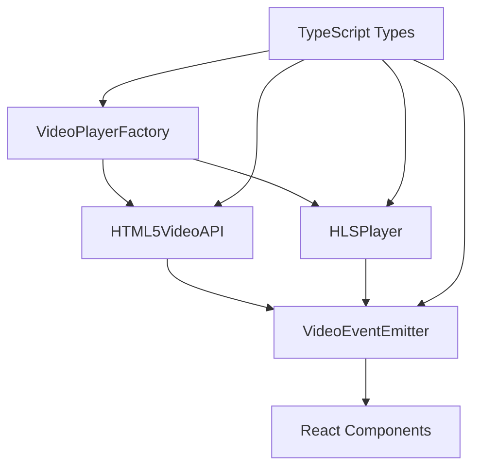

# 🎥 视频播放器模块技术指南

> 基于TypeScript的事件驱动视频播放器，展示现代前端开发的高级技术特性

## 📖 目录

- [项目概述](#项目概述)
- [核心技术栈](#核心技术栈)
- [TypeScript高级特性应用](#typescript高级特性应用)
- [设计模式实践](#设计模式实践)
- [事件驱动架构](#事件驱动架构)
- [HTML5 Video API封装](#html5-video-api封装)
- [HLS流媒体技术](#hls流媒体技术)
- [React组件设计](#react组件设计)
- [性能优化策略](#性能优化策略)
- [测试与调试](#测试与调试)
- [最佳实践总结](#最佳实践总结)

## 🎯 项目概述

本视频模块是一个完整的现代前端项目，展示了如何使用TypeScript、React和现代Web API构建一个功能完整的视频播放器系统。项目不仅实现了基础的视频播放功能，更重要的是展示了多种高级编程技术和设计模式的实际应用。

### 🏗️ 架构特点



## 🛠️ 核心技术栈

### 前端框架与库
- **Next.js 15.3.5** - React全栈框架
- **React 18** - 用户界面库
- **TypeScript 5** - 类型安全的JavaScript超集
- **Tailwind CSS** - 原子化CSS框架

### 视频技术
- **HTML5 Video API** - 原生视频播放
- **HLS.js** - HTTP Live Streaming支持
- **Picture-in-Picture API** - 画中画功能
- **Fullscreen API** - 全屏播放

### 开发工具
- **Jest** - JavaScript测试框架
- **React Testing Library** - React组件测试
- **ESLint** - 代码质量检查
- **Turbopack** - 高性能打包工具

## 🔥 TypeScript高级特性应用

### 1. 联合类型 (Union Types)

联合类型用于定义可能的值集合，提供类型安全的同时保持灵活性。

```typescript
// 视频状态联合类型
export type VideoState = 
  | 'idle'      // 空闲状态
  | 'loading'   // 加载中
  | 'canplay'   // 可以播放
  | 'play'      // 开始播放
  | 'playing'   // 正在播放
  | 'pause'     // 暂停播放
  | 'paused'    // 已暂停
  | 'seeking'   // 跳转中
  | 'waiting'   // 等待数据
  | 'ended'     // 播放结束
  | 'error';    // 播放错误

// 视频质量字面量类型
export type VideoQuality = '240p' | '360p' | '480p' | '720p' | '1080p' | '1440p' | '2160p' | 'auto';

// 播放速度字面量类型
export type PlaybackRate = 0.25 | 0.5 | 0.75 | 1 | 1.25 | 1.5 | 1.75 | 2;
```

**知识点应用**：
- 🎯 **类型安全**：编译时检查，避免无效的状态值
- 🎯 **智能提示**：IDE提供精确的自动补全
- 🎯 **文档化**：类型本身就是最好的文档

### 2. 泛型约束 (Generic Constraints)

泛型约束确保类型参数满足特定条件，提供灵活性的同时保证类型安全。

```typescript
// 泛型约束 - 确保配置有效
type ValidVideoConfig<T extends VideoConfig> = T extends VideoConfig
  ? T['sources'] extends VideoSource[]
    ? T['sources']['length'] extends 0
      ? never // 不允许空源数组
      : T
    : never
  : never;

// 视频播放器工厂的泛型方法
create<T extends VideoConfig>(
  element: HTMLVideoElement,
  config: ValidVideoConfig<T>
): VideoPlayerFromConfig<T> {
  // 实现...
}
```

**知识点应用**：
- 🔒 **编译时验证**：确保配置对象结构正确
- 🔧 **类型推导**：根据输入自动推导返回类型
- 📝 **约束条件**：防止无效配置传入

### 3. 条件类型 (Conditional Types)

条件类型根据类型条件动态确定最终类型，实现高度灵活的类型系统。

```typescript
// 条件类型 - 根据源类型确定播放器类型
type PlayerTypeFromSources<T extends VideoSource[]> = 
  T[number]['type'] extends 'hls'
    ? 'hls'
    : T[number]['type'] extends 'dash'
    ? 'dash'
    : 'html5';

// 条件类型 - 根据格式类型确定是否需要额外库
export type RequiresExternalLib<T extends VideoFormat> = 
  T extends 'hls' ? true :
  T extends 'dash' ? true :
  false;

// 映射类型 - 从配置生成播放器类型
export type VideoPlayerFromConfig<T extends VideoConfig> = T extends HLSVideoConfig<infer U>
  ? IVideoPlayer<HLSVideoConfig<U>>
  : IVideoPlayer<T>;
```

**知识点应用**：
- 🧠 **智能类型推导**：根据配置自动选择正确的播放器类型
- 🔄 **类型转换**：在不同类型间建立映射关系
- ⚡ **编译时优化**：减少运行时类型检查

### 4. 映射类型 (Mapped Types)

映射类型基于现有类型创建新类型，实现类型的批量转换。

```typescript
// 事件名称到数据的映射
export type VideoEventMap = {
  [K in VideoEventType as VideoEventName<K>]: VideoEventData<K>;
};

// 深度只读类型
export type DeepReadonly<T> = {
  readonly [P in keyof T]: T[P] extends object ? DeepReadonly<T[P]> : T[P];
};

// 部分更新类型
export type VideoConfigUpdate<T extends VideoConfig = VideoConfig> = Partial<{
  [K in keyof T]: T[K] extends object ? Partial<T[K]> : T[K];
}>;
```

**知识点应用**：
- 🔄 **类型变换**：基于现有类型生成新的类型结构
- 🛡️ **不可变性**：确保配置对象不被意外修改
- 🎛️ **灵活更新**：支持部分配置更新

### 5. 模板字面量类型 (Template Literal Types)

模板字面量类型用于创建基于字符串模式的类型。

```typescript
// 模板字面量类型 - 生成事件名称
export type VideoEventName<T extends string> = `video:${T}`;

// 使用示例
type ReadyEventName = VideoEventName<'ready'>; // 'video:ready'
type ErrorEventName = VideoEventName<'error'>; // 'video:error'

// 在事件系统中的应用
emitVideoEvent<T extends VideoEventType>(
  type: T,
  eventData: Omit<VideoEventData<T>, 'type'>
): boolean {
  const eventName = `video:${type}` as VideoEventName<T>;
  return this.emit(eventName, fullEventData);
}
```

**知识点应用**：
- 🏷️ **命名规范**：强制事件名称遵循特定模式
- 🔗 **类型关联**：建立字符串和类型之间的强关联
- 📋 **自动生成**：基于模板自动生成相关类型

## 🏛️ 设计模式实践

### 1. 工厂模式 (Factory Pattern)

工厂模式用于创建对象，根据不同条件返回不同类型的实例。

```typescript
export class VideoPlayerFactory {
  /**
   * 智能创建播放器 - 根据环境和配置自动选择最佳播放器
   */
  createSmart<T extends VideoConfig>(
    element: HTMLVideoElement,
    config: ValidVideoConfig<T>
  ): VideoPlayerFromConfig<T> {
    const hasHLS = config.sources.some(source => source.type === 'hls');
    
    if (hasHLS) {
      const hlsSupport = detectHLSSupport();
      
      if (!hlsSupport.supported) {
        throw new Error('HLS playback not supported in this environment');
      }
      
      const hlsConfig = this.ensureHLSConfig(config);
      return this.createHLSPlayer(element, hlsConfig as any) as unknown as VideoPlayerFromConfig<T>;
    }
    
    return this.createHTML5Player(element, config) as unknown as VideoPlayerFromConfig<T>;
  }
}
```

**知识点应用**：
- 🏭 **对象创建**：统一的对象创建接口
- 🧠 **智能选择**：根据环境自动选择合适的实现
- 🔧 **配置管理**：集中处理不同类型的配置

### 2. 策略模式 (Strategy Pattern)

策略模式定义一系列算法，并使它们可以互换。

```typescript
// 不同的播放策略
interface PlaybackStrategy {
  play(): Promise<void>;
  pause(): void;
  seek(time: number): void;
}

// HTML5策略
class HTML5Strategy implements PlaybackStrategy {
  constructor(private element: HTMLVideoElement) {}
  
  async play(): Promise<void> {
    await this.element.play();
  }
  
  pause(): void {
    this.element.pause();
  }
  
  seek(time: number): void {
    this.element.currentTime = time;
  }
}

// HLS策略
class HLSStrategy implements PlaybackStrategy {
  constructor(private hls: Hls, private element: HTMLVideoElement) {}
  
  async play(): Promise<void> {
    await this.element.play();
  }
  
  pause(): void {
    this.element.pause();
  }
  
  seek(time: number): void {
    this.element.currentTime = time;
  }
}
```

**知识点应用**：
- 🎯 **算法封装**：将不同的播放逻辑封装成独立策略
- 🔄 **运行时切换**：根据需要动态切换播放策略
- 🧩 **松耦合**：策略与使用者解耦

### 3. 观察者模式 (Observer Pattern)

观察者模式定义对象间的一对多依赖关系。

```typescript
export class VideoEventEmitter<TEventMap extends Record<string, any> = VideoEventMap> {
  private eventListeners: Map<keyof TEventMap, Set<Function>> = new Map();
  
  /**
   * 添加事件监听器
   */
  on<K extends keyof TEventMap>(
    event: K,
    listener: (data: TEventMap[K]) => void
  ): this {
    if (!this.eventListeners.has(event)) {
      this.eventListeners.set(event, new Set());
    }
    
    const eventListeners = this.eventListeners.get(event)!;
    eventListeners.add(listener);
    return this;
  }
  
  /**
   * 发射事件
   */
  emit<K extends keyof TEventMap>(event: K, data: TEventMap[K]): boolean {
    const eventListeners = this.eventListeners.get(event);
    if (eventListeners && eventListeners.size > 0) {
      const listenersArray = Array.from(eventListeners);
      for (const listener of listenersArray) {
        try {
          listener(data);
        } catch (error) {
          console.error(`Error in event listener for '${String(event)}':`, error);
        }
      }
      return true;
    }
    return false;
  }
}
```

**知识点应用**：
- 📡 **事件驱动**：基于事件的异步通信机制
- 🔗 **解耦合**：发布者和订阅者相互独立
- 📊 **状态同步**：多个组件可以同步响应状态变化

### 4. 适配器模式 (Adapter Pattern)

适配器模式将一个类的接口转换成客户希望的另一个接口。

```typescript
// 适配器Hook - 统一不同状态管理方式的接口
export const useFlowAdapter = () => {
  // 尝试获取useReducer版本的context
  const reducerContext = useContext(FlowReducerContext);
  
  // 尝试获取useState版本的context  
  const stateContext = useContext(FlowContext);
  
  // 优先使用useReducer版本，如果不存在则使用useState版本
  const context = reducerContext || stateContext;
  
  if (!context) {
    throw new Error('useFlowAdapter must be used within FlowProvider or FlowReducerProvider');
  }
  
  // 统一的接口适配
  return {
    ...context,
    stateManager: reducerContext ? 'useReducer' as const : 'useState' as const
  };
};
```

**知识点应用**：
- 🔌 **接口统一**：为不同实现提供统一接口
- 🌉 **兼容性**：新旧系统之间的桥梁
- 🎭 **透明代理**：使用者无需关心底层实现差异

## ⚡ 事件驱动架构

### 事件系统设计

```typescript
// 事件类型定义
export type VideoEventType = 
  // HTML5 Video Events
  | 'loadstart' | 'loadedmetadata' | 'loadeddata'
  | 'canplay' | 'canplaythrough'
  | 'play' | 'playing' | 'pause'
  | 'seeking' | 'seeked' | 'waiting'
  | 'timeupdate' | 'progress'
  | 'volumechange' | 'ratechange'
  | 'ended' | 'error'
  // 自定义事件
  | 'qualitychange' | 'fullscreenchange'
  | 'pip' | 'buffering' | 'ready';

// 事件数据接口
export interface VideoEventData<T extends VideoEventType = VideoEventType> {
  type: T;
  timestamp: number;
  currentTime: number;
  duration: number;
  // 条件类型 - 根据事件类型决定payload类型
  payload: T extends 'error' 
    ? VideoError
    : T extends 'qualitychange'
    ? { from: VideoQuality; to: VideoQuality }
    : T extends 'ratechange'
    ? { rate: PlaybackRate }
    : Record<string, any>;
}
```

### 事件中间件系统

```typescript
export type EventMiddleware<TEventMap extends Record<string, any> = VideoEventMap> = {
  <K extends keyof TEventMap>(
    event: K,
    data: TEventMap[K],
    next: () => void
  ): void;
};

// 常用中间件
export const loggingMiddleware: EventMiddleware<VideoEventMap> = (event, data, next) => {
  console.log(`[VideoEvent] ${String(event)}:`, data);
  next();
};

export const timingMiddleware: EventMiddleware<VideoEventMap> = (event, data, next) => {
  const start = performance.now();
  next();
  const end = performance.now();
  console.log(`[VideoEvent] ${String(event)} took ${end - start}ms`);
};
```

**知识点应用**：
- 🔄 **异步通信**：组件间的异步消息传递
- 🎛️ **中间件模式**：可插拔的事件处理逻辑
- 📊 **状态管理**：基于事件的状态同步机制

## 🎬 HTML5 Video API封装

### API封装设计

```typescript
export class HTML5VideoAPI<TConfig extends VideoConfig = VideoConfig> 
  implements IVideoPlayer<TConfig> {
  
  private _element: HTMLVideoElement;
  private _eventEmitter: VideoEventEmitterTyped;
  
  // 绑定原生视频事件
  private bindVideoEvents(): void {
    const eventMap: Record<string, VideoEventType> = {
      'loadstart': 'loadstart',
      'loadedmetadata': 'loadedmetadata',
      'play': 'play',
      'playing': 'playing',
      // ... 更多事件映射
    };

    Object.entries(eventMap).forEach(([domEvent, videoEvent]) => {
      this._element.addEventListener(domEvent, (e) => {
        this.handleVideoEvent(videoEvent, e);
      });
    });
  }
  
  // 处理视频事件
  private handleVideoEvent(eventType: VideoEventType, domEvent: Event): void {
    // 更新内部状态
    this.updateState(eventType);
    this.updateMetadata();
    this.updateStats(eventType);
    
    // 创建标准化事件数据
    const eventData = this.createEventData(eventType, domEvent);
    
    // 发射标准化事件
    this.emit(eventType, eventData);
  }
}
```

### 性能监控集成

```typescript
// 性能监控
private setupPerformanceMonitoring(): void {
  if ('PerformanceObserver' in window) {
    this._performanceObserver = new PerformanceObserver((list) => {
      const entries = list.getEntries();
      for (const entry of entries) {
        if (entry.name.includes('video')) {
          this.handlePerformanceEntry(entry);
        }
      }
    });
    
    try {
      this._performanceObserver.observe({ entryTypes: ['measure', 'navigation'] });
    } catch (e) {
      console.warn('Performance monitoring not supported:', e);
    }
  }
}
```

**知识点应用**：
- 🎯 **API标准化**：统一不同浏览器的API差异
- 📊 **性能监控**：集成Web Performance API
- 🔄 **事件转换**：将DOM事件转换为应用事件

## 📺 HLS流媒体技术

### HLS.js集成

```typescript
export class HLSPlayer<T extends Record<string, any> = Record<string, any>> 
  extends HTML5VideoAPI<HLSVideoConfig<T>> {
  
  private _hls: Hls | null = null;
  private _qualityLevels: HLSQualityLevel[] = [];
  
  // 初始化HLS.js
  private initializeHLSJS(): void {
    const hlsConfig = this.createHLSConfig();
    this._hls = new Hls(hlsConfig);
    
    this.bindHLSEvents();
    this.loadHLSSource();
  }
  
  // 绑定HLS事件
  private bindHLSEvents(): void {
    if (!this._hls) return;

    const eventMap = {
      [Hls.Events.MANIFEST_LOADED]: (event, data) => {
        this._isLiveStream = data.live;
        this.processQualityLevels(data.levels);
        
        this.emitEvent('ready', { 
          method: 'hls.js',
          live: this._isLiveStream,
          levels: data.levels.length
        }, 0, data.totalduration || 0);
      },
      
      [Hls.Events.LEVEL_SWITCHING]: (event, data) => {
        const newLevel = this._qualityLevels[data.level];
        const oldLevel = this._qualityLevels[this._currentLevel] || { name: 'auto' as VideoQuality };
        
        this._currentLevel = data.level;
        
        this.emitEvent('qualitychange', {
          from: oldLevel.name,
          to: newLevel?.name || 'auto'
        });
      }
    };

    Object.entries(eventMap).forEach(([event, handler]) => {
      this._hls!.on(event as any, handler);
    });
  }
}
```

### 自适应比特率管理

```typescript
// 设置视频质量
setQuality(quality: VideoQuality): void {
  if (!this._hls) {
    super.setQuality(quality);
    return;
  }

  const oldQuality = this.getCurrentQuality();

  if (quality === 'auto') {
    this._hls.currentLevel = -1; // 启用自动质量
    this._currentLevel = -1;
  } else {
    const levelIndex = this._qualityLevels.findIndex(level => level.name === quality);
    if (levelIndex !== -1) {
      this._hls.currentLevel = this._qualityLevels[levelIndex].level;
      this._currentLevel = levelIndex;
    }
  }

  // 发射质量变更事件
  this.emitEvent('qualitychange', { from: oldQuality, to: quality });
}
```

**知识点应用**：
- 📡 **流媒体协议**：HTTP Live Streaming (HLS) 支持
- 🎚️ **自适应比特率**：根据网络条件自动调整视频质量
- 📱 **多设备兼容**：支持移动端和桌面端

## ⚛️ React组件设计

### Hook设计模式

```typescript
// 自定义Hook - 视频播放器管理
const useVideoPlayer = (config: VideoConfig) => {
  const videoRef = useRef<HTMLVideoElement>(null);
  const playerRef = useRef<IVideoPlayer | null>(null);
  const [playerState, setPlayerState] = useState<PlayerState>({
    state: 'idle',
    currentTime: 0,
    duration: 0,
    // ... 其他状态
  });

  // 初始化播放器
  const initializePlayer = useCallback((config: VideoConfig) => {
    if (!videoRef.current) return;

    if (playerRef.current) {
      playerRef.current.destroy();
    }

    try {
      const player = createSmartVideoPlayer(videoRef.current, config);
      playerRef.current = player;

      // 绑定事件监听器
      const eventTypes: VideoEventType[] = [
        'loadstart', 'loadedmetadata', 'play', 'playing',
        'pause', 'timeupdate', 'error', 'qualitychange'
      ];

      eventTypes.forEach(eventType => {
        player.on(eventType, (eventData) => {
          handleVideoEvent(eventType, eventData);
        });
      });
    } catch (error) {
      console.error('Failed to initialize player:', error);
    }
  }, []);

  return {
    videoRef,
    playerRef,
    playerState,
    initializePlayer
  };
};
```

### 组件状态管理

```typescript
const VideoPlayerDemo: React.FC = () => {
  // 状态管理
  const [selectedDemo, setSelectedDemo] = useState<number>(0);
  const [eventLogs, setEventLogs] = useState<EventLog[]>([]);
  const [showEvents, setShowEvents] = useState(false);
  
  // 事件处理
  const handleVideoEvent = useCallback((type: VideoEventType, data: VideoEventData) => {
    // 记录事件日志
    const logEntry: EventLog = {
      id: `${Date.now()}_${Math.random()}`,
      timestamp: Date.now(),
      type,
      data: data.payload
    };

    setEventLogs(prev => [logEntry, ...prev.slice(0, 49)]);

    // 更新播放器状态
    setPlayerState(prev => {
      const newState = { ...prev };
      
      switch (type) {
        case 'timeupdate':
          newState.currentTime = data.currentTime;
          newState.duration = data.duration;
          break;
        case 'qualitychange':
          if ('to' in data.payload) {
            newState.quality = data.payload.to;
          }
          break;
        // ... 处理其他事件
      }
      
      return newState;
    });
  }, []);
  
  // 组件渲染...
};
```

**知识点应用**：
- 🎣 **自定义Hook**：逻辑复用和状态管理
- 🔄 **状态同步**：React状态与视频状态的同步
- 🎛️ **事件处理**：优雅的事件监听和处理机制

## ⚡ 性能优化策略

### 1. 内存管理

```typescript
// 播放器销毁和清理
destroy(): void {
  if (this._isDestroyed) return;
  
  this._isDestroyed = true;
  
  // 停止性能监控
  if (this._performanceObserver) {
    this._performanceObserver.disconnect();
  }
  
  // 清理HLS资源
  if (this._hls) {
    this._hls.destroy();
    this._hls = null;
  }
  
  // 清理视频元素
  this._element.pause();
  this._element.removeAttribute('src');
  this._element.load();
  
  // 清理事件监听器
  this._eventEmitter.destroy();
}
```

### 2. 事件防抖

```typescript
// 防抖的时间更新事件
const debouncedTimeUpdate = useMemo(
  () => debounce((currentTime: number, duration: number) => {
    setPlayerState(prev => ({
      ...prev,
      currentTime,
      duration
    }));
  }, 100),
  []
);
```

### 3. 懒加载和代码分割

```typescript
// 动态导入HLS.js
const loadHLS = async () => {
  const { default: Hls } = await import('hls.js');
  return Hls;
};

// 条件加载
if (hasHLSSource && !Hls.isSupported()) {
  const HlsClass = await loadHLS();
  // 使用动态加载的HLS类
}
```

**知识点应用**：
- 🧹 **资源清理**：防止内存泄漏
- ⏱️ **防抖节流**：优化高频事件处理
- 📦 **代码分割**：按需加载减少包体积

## 🧪 测试与调试

### 单元测试示例

```typescript
describe('VideoEventEmitter', () => {
  let emitter: VideoEventEmitter;
  
  beforeEach(() => {
    emitter = new VideoEventEmitter();
  });
  
  test('should emit and receive events', () => {
    const mockListener = jest.fn();
    
    emitter.on('test-event', mockListener);
    emitter.emit('test-event', { data: 'test' });
    
    expect(mockListener).toHaveBeenCalledWith({ data: 'test' });
  });
  
  test('should handle event listener errors gracefully', () => {
    const errorListener = jest.fn(() => {
      throw new Error('Test error');
    });
    
    const consoleSpy = jest.spyOn(console, 'error').mockImplementation();
    
    emitter.on('test-event', errorListener);
    emitter.emit('test-event', {});
    
    expect(consoleSpy).toHaveBeenCalled();
    consoleSpy.mockRestore();
  });
});
```

### 集成测试

```typescript
describe('HLSPlayer Integration', () => {
  let videoElement: HTMLVideoElement;
  let player: HLSPlayer;
  
  beforeEach(() => {
    videoElement = document.createElement('video');
    const config: HLSVideoConfig = {
      sources: [{ src: 'test.m3u8', type: 'hls' }],
      hls: { debug: false }
    };
    player = new HLSPlayer(videoElement, config);
  });
  
  afterEach(() => {
    player.destroy();
  });
  
  test('should initialize HLS player correctly', () => {
    expect(player.state).toBe('idle');
    expect(player.getAvailableQualities()).toContain('auto');
  });
});
```

**知识点应用**：
- 🔬 **单元测试**：确保单个功能模块正确性
- 🔗 **集成测试**：验证模块间协作
- 🐛 **错误处理**：优雅的错误处理和恢复

## 📋 最佳实践总结

### 1. TypeScript最佳实践

```typescript
// ✅ 使用严格的类型定义
interface StrictVideoConfig {
  readonly sources: readonly VideoSource[];
  readonly autoplay: boolean;
  readonly controls: boolean;
}

// ✅ 使用类型守卫
export const isVideoState = (value: any): value is VideoState => {
  return typeof value === 'string' && [
    'idle', 'loading', 'canplay', 'playing', 'paused'
  ].includes(value);
};

// ✅ 使用断言函数
export const assertVideoConfig = <T extends VideoConfig>(config: any): asserts config is T => {
  if (!config || typeof config !== 'object') {
    throw new Error('Invalid video configuration');
  }
  if (!Array.isArray(config.sources) || config.sources.length === 0) {
    throw new Error('Video configuration must have at least one source');
  }
};
```

### 2. 事件系统最佳实践

```typescript
// ✅ 统一的事件命名规范
const EVENT_PREFIX = 'video:' as const;

// ✅ 类型安全的事件发射
emitEvent<T extends VideoEventType>(
  type: T, 
  payload: ExtractEventPayload<T>
): void {
  const eventData: VideoEventData<T> = {
    type,
    timestamp: Date.now(),
    currentTime: this.element.currentTime,
    duration: this.element.duration || 0,
    payload
  };
  
  this.emit(`${EVENT_PREFIX}${type}`, eventData);
}

// ✅ 错误边界处理
try {
  listener(eventData);
} catch (error) {
  console.error(`Error in event listener for '${event}':`, error);
  // 不阻断其他监听器的执行
}
```

### 3. 性能优化最佳实践

```typescript
// ✅ 使用对象池减少GC压力
class EventDataPool {
  private pool: VideoEventData[] = [];
  
  get(): VideoEventData {
    return this.pool.pop() || this.create();
  }
  
  release(eventData: VideoEventData): void {
    this.reset(eventData);
    this.pool.push(eventData);
  }
  
  private create(): VideoEventData {
    return {
      type: 'idle',
      timestamp: 0,
      currentTime: 0,
      duration: 0,
      payload: {}
    };
  }
}

// ✅ 使用WeakMap避免内存泄漏
const playerInstances = new WeakMap<HTMLVideoElement, IVideoPlayer>();
```

### 4. 错误处理最佳实践

```typescript
// ✅ 分层错误处理
class VideoError extends Error {
  constructor(
    message: string,
    public readonly code: VideoErrorCode,
    public readonly recoverable: boolean = false,
    public readonly details?: Record<string, any>
  ) {
    super(message);
    this.name = 'VideoError';
  }
}

// ✅ 优雅降级
async function createPlayerWithFallback(
  element: HTMLVideoElement,
  config: VideoConfig
): Promise<IVideoPlayer> {
  try {
    return createSmartVideoPlayer(element, config);
  } catch (error) {
    console.warn('Smart player creation failed, falling back to HTML5:', error);
    return createHTML5VideoPlayer(element, config);
  }
}
```

## 🎓 学习收获

通过这个视频模块项目，我们深入实践了：

### TypeScript高级特性
- **类型系统设计**：从简单类型到复杂的条件类型和映射类型
- **泛型编程**：类型安全的同时保持代码灵活性
- **类型推导**：让编译器为我们工作

### 设计模式应用
- **工厂模式**：统一对象创建接口
- **策略模式**：算法的封装和互换
- **观察者模式**：事件驱动的解耦架构
- **适配器模式**：接口统一和兼容性处理

### 现代前端技术
- **事件驱动架构**：构建响应式和可扩展的系统
- **Web API集成**：充分利用浏览器原生能力
- **性能优化**：内存管理、防抖节流、代码分割

### 工程化实践
- **模块化设计**：清晰的职责分离
- **类型安全**：编译时错误检查
- **测试驱动**：确保代码质量和可维护性

---

## 🚀 项目访问

- **本地开发**: `http://localhost:3003`
- **主页**: `/` - useState版本演示
- **Reducer版本**: `/reducer` - useReducer版本演示
- **视频模块**: `/video` - 完整视频播放器演示

## 📚 扩展阅读

- [TypeScript Handbook](https://www.typescriptlang.org/docs/)
- [React Patterns](https://reactpatterns.com/)
- [Web Video API](https://developer.mozilla.org/en-US/docs/Web/API/HTMLVideoElement)
- [HLS.js Documentation](https://github.com/video-dev/hls.js/)

---

*本项目展示了现代前端开发的最佳实践，从类型设计到架构模式，从性能优化到用户体验，每一个细节都体现了专业的工程化思维。*
